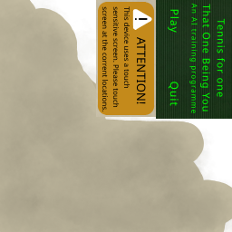

# Tennis For One - That One Being You
- [Tennis For One - That One Being You](#tennis-for-one---that-one-being-you)
- [Overview](#overview)
- [Gameplay](#gameplay)
  - [Matches](#matches)
    - [Controls](#controls)
    - [Shot types](#shot-types)
      - [Normal shot](#normal-shot)
      - [Slice shot](#slice-shot)
      - [Powershot](#powershot)
  - [Between Matches](#between-matches)
    - [Skill points](#skill-points)

# Overview
WRITE A STORY DUMBASS

# Gameplay
## Matches
Tennis matches are confined in a [DESIGN ARENA]. Inside of said space, you are placed in a Zero-G plexi rectangle. After a brief countdown, the ball will be served by the player first. After serving, each bounce of the ball will slow it down to a minimum amount, which is determined by difficulty (EG.: progression). If the player or the AI lets the ball slip to their backboard, the other person wins the round. [DESIGN SCORING SYSTEM]. First one to win 2 games wins the match.
### Controls
The player controls the racket with their mouse. Depending on their [skill level](#skill-points), the racket may move faster towards the mouse. Racket angle is dependent on the distance from the center point.

### Shot types
There are 3 different ways to hit the ball.
#### Normal shot
Normal shots are the ones where the racket simply hits the ball without any further user input. The ball's velocity will increase slightly and the direction of the ball will be calculatedy by the distance from the middle of the racket, by normal rules. 
#### Slice shot
With a certain key, the player can initiate a *Slice Shot*. A Slice shot leaves the racket in a Semi-frozen state, where it sort of tries to go to the cursor, but is bound towards the point in which the racket was when the slice key was pressed. Uppon another press of the key (and given that the cursor is far enough away.), the racket will quickly ([although quickness depends on skill level](#skill-points)) snap to the cursor. But, if the conditions are not met, and the cursors is not far enough away, the racket will simply return to its default state. If the ball is hit during the snap-event, where the "slicing" rakcet is still travelling to the cursor, the ball's direction will grealty change, given the angle, and will also get a speed boost, although not a significant amount. This shot is mainly used to bounce the ball around, confusing slower player.
#### Powershot
The most powerful shot type. The player first needs to fill up their power bar in order to use this. Hitting balls regurarly gives a certain amount of fillage to the bar, slice-shots give a lot more, 1.5 times as much. If the bar is filled, pressing the power shot button freeze the racket in place. In this state, the bar begins to drain. If the player presses the button while the bar is not fully drained, the move will be canceled, and the ***drained*** power bar remains. If, however, the bar is fully depleted, another press of the button will swing the racket. If the ball is hit during this swing, the ball's trajectory wont change as much, however, the ball will gain a significant speed boost. 

## Between Matches
### Skill points